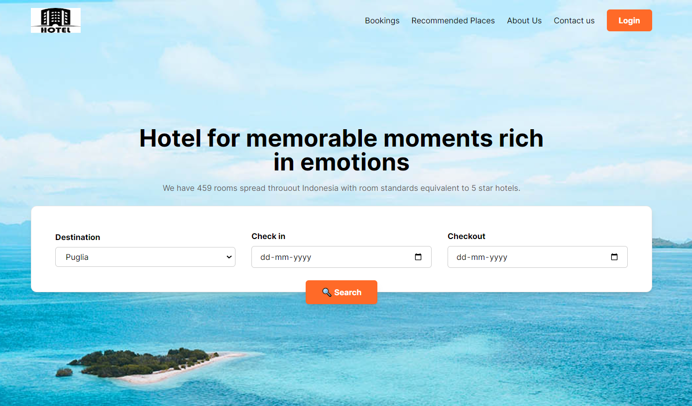
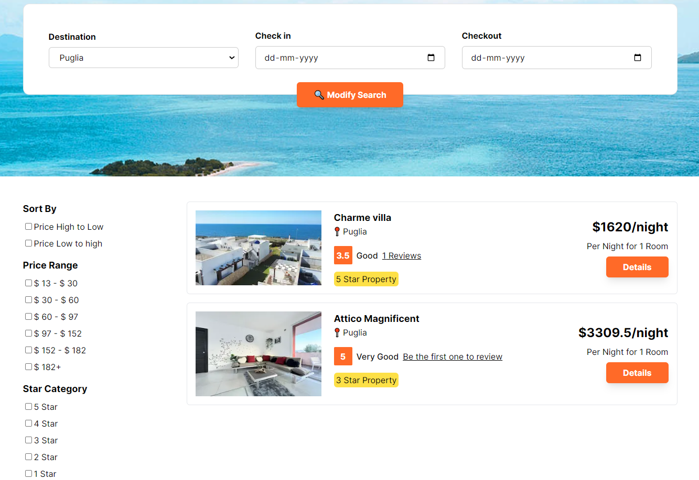
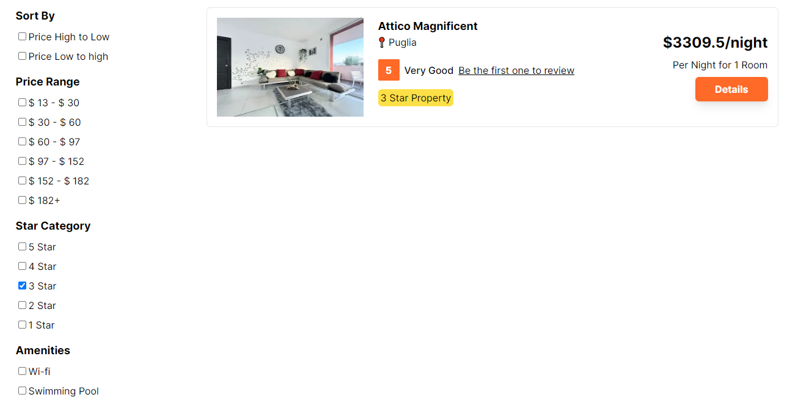
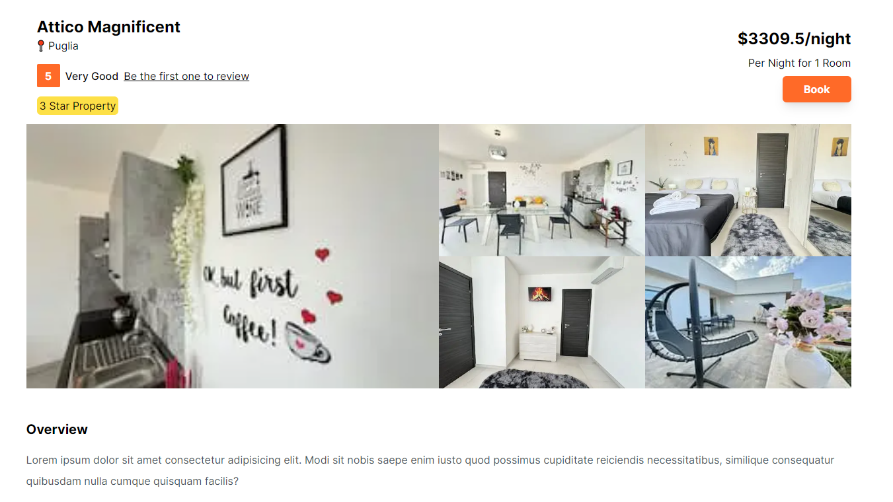
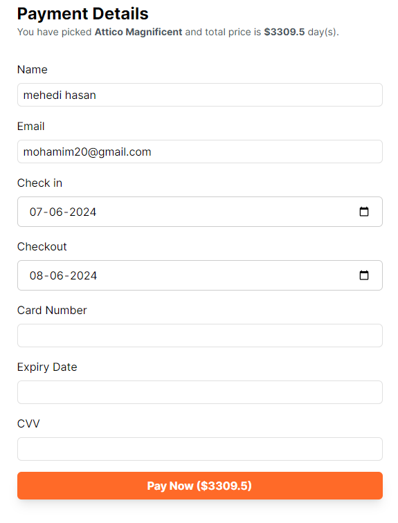
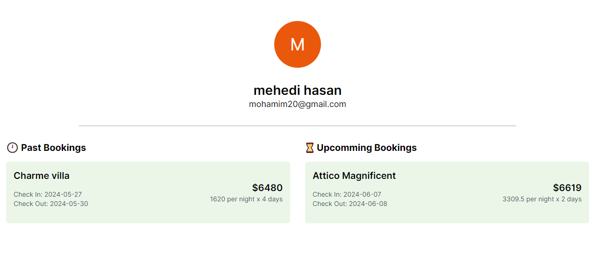

# Hotel Booking Application

## Overview
  
Welcome to the Hotel Booking Application! This application allows users to search for hotels, sort them by rating, view detailed information about each hotel, book a hotel after logging in, and view their past and upcoming bookings. This README will guide you through the key features and functionality of the application.

## Table of Contents
1. [Features](#features)
2. [Installation](#installation)
3. [Usage](#usage)
    1. [Search Hotels](#search-hotels)
    2. [Sort Hotels by Rating](#sort-hotels-by-rating)
    3. [View Hotel Details](#view-hotel-details)
    4. [Book a Hotel](#book-a-hotel)
    5. [View Bookings](#view-bookings)


## Features
- **Search Hotels**: Find hotels based on your desired location and dates.
- **Sort Hotels by Rating**: Sort the list of hotels based on their ratings to find the best options.
- **View Hotel Details**: Access detailed information about each hotel including amenities, reviews, and pricing.
- **Book a Hotel**: Securely book a hotel room after logging into your account.
- **View Bookings**: See a list of your past and upcoming bookings in one place.

## Installation
To run the Hotel Booking Application on your local machine, follow these steps:

1. **Clone the Repository**:
   ```sh
   git clone https://github.com/yourusername/hotel-booking-app.git
   cd hotel-booking-app
   ```

2. **Install Dependencies**:
   ```sh
   npm install
   ```

3. **Start the Application**:
   ```sh
   npm start
   ```

   The application will be available at `http://localhost:3000`.

## Usage

### 1. Search Hotels :
  
- **Description**: Use the search functionality to find hotels based on your destination and travel dates.
- **Steps**:
  1. Navigate to the search bar on the homepage.
  2. Enter your desired location and travel dates.
  3. Click the "Search" button to see a list of available hotels.

### 2. Sort Hotels by Rating :
  
- **Description**: Sort the list of hotels by their ratings to find the highest-rated accommodations.
- **Steps**:
  1. After performing a search, locate the sorting options at the top of the results list.
  2. Select "Sort by Rating".
  3. The hotels will be re-ordered based on their ratings, with the highest-rated hotels appearing first.

### 3. View Hotel Details :
  
- **Description**: Access detailed information about a specific hotel.
- **Steps**:
  1. From the search results, click on the details button of the hotel you are interested in.
  2. You will be redirected to the hotel's detail page, where you can view amenities, reviews, photos, and pricing.

### 4. Book a Hotel :
  
- **Description**: Book a hotel room after logging into your account.
- **Steps**:
  1. On the hotel detail page, click the "Book" button.
  2. If you are not logged in, you will be prompted to log in or create an account.
  3. After logging in, fill out the booking form with the necessary details.
  4. Click "Confirm Booking" to finalize your reservation.
  5. You will receive a booking confirmation via email.

### 5. View Bookings :
  
- **Description**: View your past and upcoming bookings.
- **Steps**:
  1. Log in to your account.
  2. Navigate to the "Bookings" section from the user menu.
  3. Here, you can view a list of all your bookings, both past and upcoming.


---